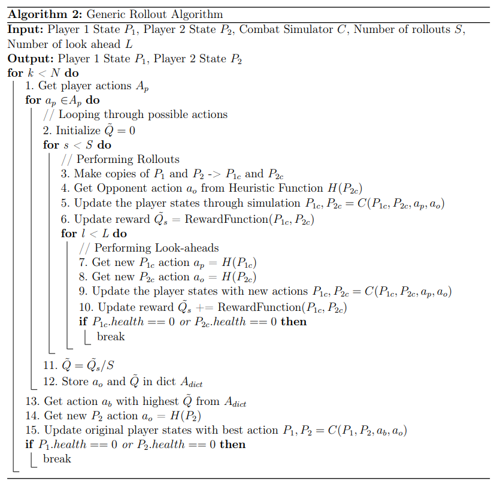

# RuneScape 3 Dynamic Programming Experiment - IFT6521
Dynamic programming project featuring RuneScape3 Combat. An analysis of different exact and approximative dynamic programming techniques.

## Project Description
The combat in RuneScape 
consists of:
* **Combat triangle**: There are three types of combats (melee, ranged, and magic), that 
are each strong against one style of combat, and weaker against another.
* **Player Levels**: Each player has to train levels with respect to these combat styles, which can range between 1 and 99 (with 99 being the max), and 
will contribute to the accuracy and damage of that player in that style. 
* **Statuses**: Each combat style has its own unique abilities that can be synergized together, add bleed effects, stun, bind, and remove 
stuns. 
* **Stochasticity**: Abilities have a chance of being blocked by each player, depending on their defense level. This 
stochasticity is unknown to the player and based on a dice roll performed by the game itself. 
* **Adrenaline**: Abilities are also split between basic, threshold, and ultimate, which are dictated by a player’s 
adrenaline level. Basic abilities and auto attacks generate adrenaline, and when a player reaches 50% 
adrenaline in their combat, they have access to threshold abilities that deal more damage. Furthermore, 
when a player’s adrenaline reaches 100%, they will have access to ultimate abilities. It should be noted 
that threshold and ultimate abilities consume adrenaline.

Based on the above data, We will try to find the optimal ability path for melee combat through the examination of Backwards Chaining, Generic Rollouts (using a heuristic function), Monte Carlo Tree Search (MCTS), and Rollout using Parametric Approximation(Neural Network).

## RS3 Combat Simulator

Seeing as the combat system in RuneScape is quite complex, a simulator was built to enables us to 
be able to test our algorithms, by allowing us to fight two players against each other quickly and outside of the game. Using gathered data from in game testing, we attempted to replicate the in-game stochasticity within the simulator. 

<p align="center">

</p>

**Notes for the Simulator**
Due to the strict timeline, the combat simulator is missing a lot of key combat functionality, which definitely skew the results. Maybe one day if I have free time I will continue working on it to address the limitations below.
* The simulator does not take into account player movement (assumes players are side by side).
* Only currently contains stuns, bleeds, and stun-immune for statuses.
* Only currently contains abilities for Free-to-Play (F2P)
* Does not take into account the additional time a chanelled ability would take.
* Designed for 3 weapons (rune 2 hand, mystic wand + orb, magic shortbow)
* No prayers (ran out of time)

I'm sure there are other limitations that I have not listed, but hopefully it might serve as a great starting point for someone else's RS3 coding project.


## Results
Below are the results for 100 simulated combats between a melee player (95 Attack, 90 strength, 90 defence) versus a ranged opponent (99 ranged, 99 defence). The ranged opponent's actions are being dictated by a simple heuristic function that prioritizes damage and will un-stun itself by using freedom if it is ever stunned.
<p align="center">

</p>

* **Backwards Chaining (Reversed)**: This is the result of using a backwards chaining algorithm to instead of finding the best actions, cycling through the worst possible combination of actions.
* **MCTS (10 Rollouts, 10 Branching, until end)**: Monte Carlo Tree Search with 10 branches, using 10 rollouts, each rollout unravels until the end of combat.
* **Random**: Each player is assigned a random available ability, used as a benchmark for other tests.
* **MCTS (10 Rollouts, 10 Branching, 2 look-ahead)**: Monte Carlo Tree Search with 10 branches, 10 rollouts each with 2 step look-ahead.
* **Generic Rollout (10 rollouts, 2 step look)**: Generic Rollout using 10 rollours each with 2 step look-ahead.
* **Rollout Parametric (NN)**: Rollout using a parametric approximation fueled by a Feed Forward neural network trained on 120,000 random rollouts.
* **Backwards Chaining**:  Backwards chaining algorithm.

Note: Player ties are not recorded in the table above (a tie consists of both players reducing the other's Hitpoints to 0 during the same game action).  


Below you can see the ability sequence that was prioritized by the *Backwards Chaining* algorithm, which achieved a 90% win rate.  

<p align="center">

</p>

Below you can see the ability sequence that was prioritized by the *Rollout Parametric Approximation* algorithm, which also achieved a 90% win rate.
<p align="center">

</p>

## Setup

This project can be installed using the requirements.txt, though certain dependencies may require additional setup as listed below. Python Version is 3.9.13

```
pip install -r requirements.txt
```

### Cuda
Cuda 11.7 is being used for this project. Cuda can be installed at the following [Cuda Website 11.7 Link](https://developer.nvidia.com/cuda-11-7-0-download-archive)
```
+-----------------------------------------------------------------------------+
| NVIDIA-SMI 516.94       Driver Version: 516.94       CUDA Version: 11.7     |
|-------------------------------+----------------------+----------------------+
| GPU  Name            TCC/WDDM | Bus-Id        Disp.A | Volatile Uncorr. ECC |
| Fan  Temp  Perf  Pwr:Usage/Cap|         Memory-Usage | GPU-Util  Compute M. |
|                               |                      |               MIG M. |
|===============================+======================+======================|
|   0  NVIDIA GeForce ... WDDM  | 00000000:01:00.0  On |                  N/A |
|  0%   40C    P0    42W / 166W |   1722MiB /  8192MiB |      3%      Default |
|                               |                      |                  N/A |
+-------------------------------+----------------------+----------------------+

```

### Cudnn
You will also need to install the correct version of CUDNN with your Cuda. We will be using CUDNN version 8.8.0 for CUDA 11.7 [CUDNN Website Link](https://developer.nvidia.com/rdp/cudnn-archive). Login is required in order to download the files. Once the files are downloaded, you will need to place the bin, include, and library files at the designated Cuda Location (C:\Program Files\NVIDIA GPU Computing Toolkit\CUDA\v10.2)
.[This](https://medium.com/analytics-vidhya/installing-cuda-and-cudnn-on-windows-d44b8e9876b5) is a really well written guide that can help with this setup.
### Pytorch
This project uses Torch 1.13.1 which can be received at the following [Pytorch Website Link](https://pytorch.org/get-started/locally/)

```
pip install torch==1.13.1+cu117 torchvision==0.14.1+cu117 torchaudio==0.13.1 --extra-index-url https://download.pytorch.org/whl/cu117
```

## Launching the Code
Launch the algorithms.py using the --model parameter as seen below.

```
python algorithms.py --model parametric_rollout
```
The options available include: *parametric_rollout*, *random*, *generic_rollout*, *mcts*, *backwards_chain*


## Algorithms

Below you can find the algorithms of the different methods listed above!

<p align="center">

</p>

<p align="center">

</p>

<p align="center">

</p>

<p align="center">

</p>

<p align="center">

</p>

